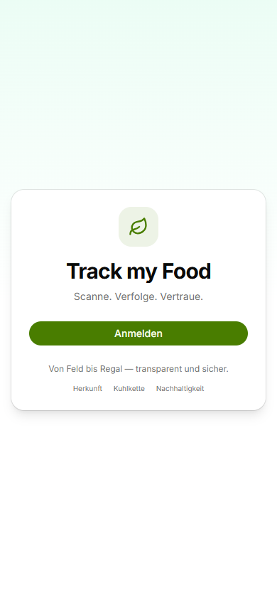
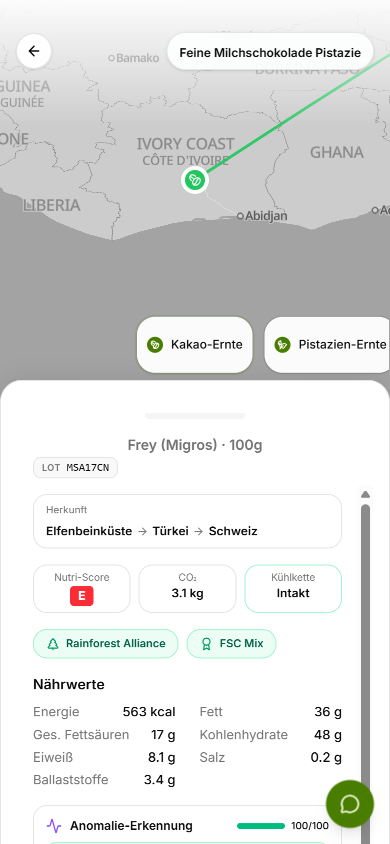
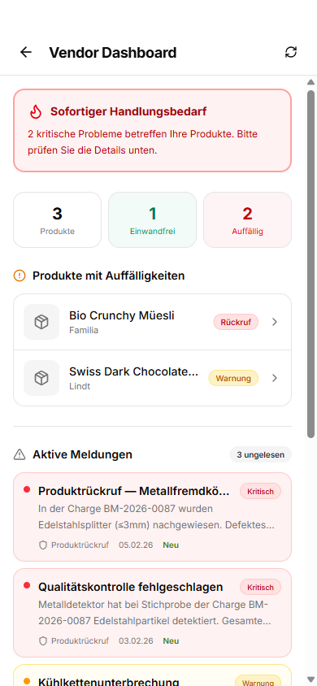

# Track my Food

**AI-powered food supply chain tracker — from field to store shelf.**

Consumers scan a barcode, see exactly where their food comes from, how it was transported, and whether the cold chain was maintained. Vendors get a dashboard to manage product quality, alerts, and customer reports.

> **{baden: hackt} 2026** — Team Autexis

| Login | Product Journey | Vendor Dashboard |
|:---:|:---:|:---:|
|  |  |  |

## Dokumentation

| Dokument | Inhalt |
|----------|--------|
| [Produktübersicht](docs/produktuebersicht.md) | Problem, Zielgruppen, Nutzen, aktueller Funktionsumfang, Roadmap |
| [Anwenderguide](docs/anwenderguide.md) | Login, Barcode-Scan, LOT-Erfassung, Produktseite, Chat, Meldungen |
| [Vendorguide](docs/vendorguide.md) | Vendor Portal, Dashboard, Rückrufe, Kundenmeldungen |
| [Technik und Betrieb](docs/technik-und-betrieb.md) | Architektur, CQRS, Clean Architecture, EPCIS, Blockchain, CI/CD |
| [Testing und Setup](docs/testing-und-setup.md) | Setup-Anleitung, Demo-Accounts, Testabdeckung, API-Referenz |

---

## Features

### Consumer App
- **Barcode Scanner** — Camera-based EAN/GTIN scanning (native BarcodeDetector + zxing-wasm fallback)
- **LOT Capture** — AI-powered OCR extracts batch/LOT numbers from packaging photos (Semantic Kernel + Gemini Vision)
- **Interactive Journey Map** — Cinematic MapLibre GL map with route polylines, camera fly-to animations, and journey event cards
- **Shelf Life Prediction** — AI-computed quality curve with risk factors and confidence scores
- **Anomaly Detection** — Cold chain monitoring with temperature spike detection and chain integrity scoring
- **Sustainability Analysis** — CO2 breakdown by supply chain stage, water footprint, transport distance (Haversine), packaging score
- **Blockchain Verification** — SHA-256 hash chain for tamper-proof supply chain verification
- **Product Chat (RAG)** — Ask questions about any product, powered by Semantic Kernel with full product context
- **Product Alternatives** — Recommends similar products with better sustainability or nutrition scores
- **Report Issues** — Multi-step reporting flow, persisted to DB, visible in vendor dashboard

### Vendor Portal (Role-based)
- **Quality Dashboard** — Overview of all products, alerts, and customer reports
- **Recall Management** — Critical alerts with severity levels, automatic product flagging
- **Customer Reports** — View and manage reports submitted by consumers
- **Role-based Access** — Only users with the `vendor` role (via Keycloak groups) see the Vendor Portal

### Standards & Integrations
- **GS1 / EPCIS 2.0** — Supply chain events mapped to EPCIS standard (ObjectEvent, bizStep, disposition)
- **OpenRouteService** — Real truck/car route polylines with intelligent caching (30-day TTL)
- **Open Food Facts** — Auto-fetch product data for unknown GTINs
- **Keycloak OIDC** — Self-hosted identity provider with custom-themed login, PKCE, role-based access

---

## Architecture

```
                    Frontend (React 19)
  Vite | Tailwind CSS v4 | shadcn/ui | MapLibre GL
  OpenAPI-generated TypeScript client
                       |
                  REST API (JWT)
                       |
                 Backend (.NET 10)
  ASP.NET Core | Clean Architecture | CQRS (Mediator)
  Entity Framework Core | Semantic Kernel
                       |
         +-------------+-------------+
         |                           |
    PostgreSQL 18              Keycloak 26
    + Route Cache              OIDC / JWT
    + EPCIS Events             RBAC
```

### Design Patterns
- **Clean Architecture** — Domain, Application, Infrastructure, API layers
- **CQRS** — Commands and queries separated via Mediator pattern
- **Result Pattern** — No exceptions for flow control, typed `Result<T>` return values
- **Authorization Behaviors** — Pipeline behaviors for authentication and validation

---

## Tech Stack

| Layer | Technology |
|---|---|
| **Frontend** | React 19, Vite, Tailwind CSS v4, shadcn/ui, MapLibre GL |
| **Backend** | .NET 10, ASP.NET Core, Entity Framework Core 10 |
| **Database** | PostgreSQL 18 |
| **Auth** | Keycloak 26 (OIDC, PKCE, RBAC) |
| **AI/ML** | Microsoft Semantic Kernel + OpenRouter (Gemini 2.0 Flash) |
| **Maps** | MapLibre GL JS, OpenRouteService |
| **Standards** | GS1/EPCIS 2.0, OpenAPI 3.0 |
| **Testing** | xUnit v3 (44 tests), EF Core InMemory |
| **CI/CD** | GitHub Actions (build + test gate on PRs) |
| **DevOps** | Docker, Docker Compose, Keycloak realm auto-import |

---

## Getting Started

### Prerequisites
- [.NET 10 SDK](https://dotnet.microsoft.com/download)
- [Bun](https://bun.sh)
- [Docker](https://www.docker.com/get-started)
- Java 11+ (for OpenAPI Generator)

### 1. Clone and start infrastructure

```bash
git clone https://github.com/PianoNic/AutexisCase.git
cd AutexisCase
docker compose -f compose.dev.yml up -d
```

This starts **PostgreSQL** (port 5433) and **Keycloak** (port 8180) with pre-configured realm, demo users, and custom login theme.

### 2. Configure secrets

```bash
cd src/AutexisCase.API
dotnet user-secrets set "ConnectionStrings:DefaultConnection" "Host=localhost;Port=5433;Database=autexiscasedb-dev;Username=autexiscase;Password=devpassword"
dotnet user-secrets set "Oidc:Authority" "http://localhost:8180/realms/autexiscase"
dotnet user-secrets set "Oidc:ClientId" "autexiscase-app"
dotnet user-secrets set "Oidc:RequireHttpsMetadata" "false"
dotnet user-secrets set "OpenRouter:ApiKey" "<your-openrouter-api-key>"
dotnet user-secrets set "OpenRouter:Model" "google/gemini-2.0-flash-001"
dotnet user-secrets set "OpenRouteService:ApiKey" "<your-ors-api-key>"
```

### 3. Run

```bash
# Backend
dotnet run --project src/AutexisCase.API

# Frontend (in another terminal)
cd src/AutexisCase.Frontend
bun install
bun run api:generate   # with backend running
bun run dev
```

- App: http://localhost:5173
- API Docs: http://localhost:5067/swagger
- Keycloak Admin: http://localhost:8180

### Demo Accounts

| User | Password | Role | Access |
|------|----------|------|--------|
| `vendor-demo` | `demo1234` | Vendor | Full app + Vendor Portal |
| `user-demo` | `demo1234` | Consumer | App only, no Vendor Portal |

---

## Testing

```bash
dotnet test src/AutexisCase.Tests
```

**44 unit tests** covering:
- Query handlers (product, batch, blockchain, shelf life, anomaly, sustainability, alternatives)
- Command handlers (scan, report)
- RoutingService (caching, great circle arc, ORS response parsing, fallback strategies)
- EpcisEventMapper (EPCIS 2.0 format validation, bizStep mapping)

CI pipeline runs `dotnet test` on every PR — merging is blocked if tests fail.

---

## Seed Data (Demo Products)

Pre-configured in `SeedData.cs` — survives DB drops:

| GTIN | LOT | Product | Status | Journey |
|------|-----|---------|--------|---------|
| 7610848001015 | LX-2026-0142 | Swiss Dark Chocolate 72% (Lindt) | Warning | Ghana > Belgium > Switzerland (cold chain break at 24C) |
| 7616500663992 | MSA17CN | Feine Milchschokolade Pistazie (Frey/Migros) | OK | Ivory Coast > Turkey > Switzerland (9 steps, real data) |
| 7613035839427 | BM-2026-0087 | Bio Crunchy Muesli (Familia) | **Recall** | Metal fragments detected, BLV recall order |

---

## API Endpoints (17 total)

| Method | Endpoint | Description |
|---|---|---|
| `GET` | `/api/Product` | List all products |
| `GET` | `/api/Product/{id}` | Full product with batches |
| `GET` | `/api/Product/gtin/{gtin}` | Lookup by barcode (auto-fetches from Open Food Facts) |
| `GET` | `/api/Product/batch/{id}` | Full batch with journey, temps, alerts |
| `GET` | `/api/Product/batch/lookup` | Lookup batch by GTIN + LOT |
| `GET` | `/api/Product/batch/{id}/route` | Route polylines (OpenRouteService) |
| `GET` | `/api/Product/batch/{id}/blockchain` | SHA-256 hash chain |
| `GET` | `/api/Product/batch/{id}/shelf-life` | Shelf life prediction |
| `GET` | `/api/Product/batch/{id}/anomalies` | Anomaly detection |
| `GET` | `/api/Product/batch/{id}/sustainability` | CO2 breakdown |
| `GET` | `/api/Product/{id}/alternatives` | Product alternatives |
| `POST` | `/api/Product/{id}/chat` | RAG product Q&A |
| `POST` | `/api/Product/{id}/report` | Report product issue |
| `POST` | `/api/Scan/{gtin}` | Record scan |
| `POST` | `/api/Epcis/events` | Capture EPCIS events |
| `GET` | `/api/Epcis/events` | Query EPCIS events |
| `POST` | `/api/Ocr/lot` | AI LOT extraction |

---

## Project Structure

```
src/
  AutexisCase.Domain/          # Entities, Enums
  AutexisCase.Application/     # Commands, Queries, DTOs, Behaviors
  AutexisCase.Infrastructure/  # DbContext, Services, Migrations, SeedData
  AutexisCase.API/             # Controllers, Middleware
  AutexisCase.Frontend/        # React + Vite + Tailwind + MapLibre
  AutexisCase.Tests/           # 44 xUnit tests
config/
  keycloak/                    # Realm + custom login theme
```
